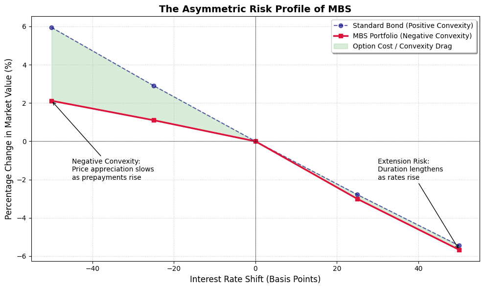

# Quantifying Negative Convexity in Mortgage-Backed Securities (MBS)

## Project Overview
This project develops a quantitative framework to model the cash flows and price sensitivity of Mortgage-Backed Securities (MBS). The primary focus is investigating the phenomenon of **Negative Convexity**—the asymmetric risk profile caused by the embedded homeowner prepayment option.

## Key Features
* **Custom Prepayment Model:** Implemented a path-dependent S-Curve model for Conditional Prepayment Rates (CPR).
* **Comparative Benchmarking:** Quantified the "Convexity Gap" by comparing MBS performance against a synthetic non-callable bond.
* **Scenario Stress Testing:** Analyzed portfolio Present Value (PV) sensitivity under ±25 and ±50 basis point interest rate shocks.

## The Quantitative Challenge: Negative Convexity
Unlike standard fixed-income instruments, MBS investors are effectively **Short Volatility**. As rates drop, prepayments spike (prepayment risk), and as rates rise, prepayments dry up (extension risk).

## Mathematical Foundation: The Geometry of Risk

To quantify how the Mortgage-Backed Security price ($P$) responds to interest rate fluctuations ($\Delta y$), we utilize a second-order Taylor expansion. This allows us to decompose price sensitivity into linear and non-linear components.

$$\frac{\Delta P}{P} \approx -D_{mod} \cdot \Delta y + \frac{1}{2} C \cdot (\Delta y)^2$$

### 1. First-Order Sensitivity: Modified Duration ($D_{mod}$)
Modified Duration represents the linear sensitivity of the bond price to a change in yields. In physics terms, this is the normalized first derivative—effectively the "velocity" of price change:

$$D_{mod} = -\frac{1}{P} \frac{\partial P}{\partial y}$$

### 2. Second-Order Sensitivity: Convexity ($C$)
Convexity captures the "curvature" of the price-yield relationship. It is the normalized second derivative—effectively the "acceleration" of price change:

$$C = \frac{1}{P} \frac{\partial^2 P}{\partial y^2}$$

### 3. The Negative Convexity Regime
For standard fixed-income instruments (e.g., non-callable Treasuries), $C > 0$. This **Positive Convexity** is a desirable trait, as it implies that prices rise faster than they fall for a given basis point move.

In the case of **Mortgage-Backed Securities**, the embedded homeowner call option introduces **Negative Convexity** ($C < 0$). As market yields decrease, the probability of prepayments spikes, causing principal to be returned prematurely. This results in a concave price-yield curve where:

$$\frac{\partial^2 P}{\partial y^2} < 0$$

This project benchmarks the MBS against a synthetic non-callable "Bullet" bond to visualize and quantify this **Convexity Gap**, measuring the cost of the "short volatility" position inherent in the mortgage market.

## Repository Contents
- `analysis.ipynb`: The primary research notebook containing data visualizations and result interpretations.
- `mbs_model.py`: A modular Python class for simulating MBS cash flows, interest rate paths.

## Results Summary
Our analysis demonstrates that the MBS exhibits significant "price capping" in falling-rate environments. At a -50bps shock, the MBS portfolio underperformed the benchmark by **3.83%**, illustrating the substantial cost of the embedded call option.

## Technical Skills Demonstrated
- **Language:** Python (NumPy, Pandas, Matplotlib)
- **Finance:** Fixed Income, Convexity/Gamma, Prepayment Modeling, Yield Curve Shifting.

## How to Run
1. Clone the repo.
2. Install dependencies: `pip install -r requirements.txt`
3. Open `analysis.ipynb` and run all cells.
